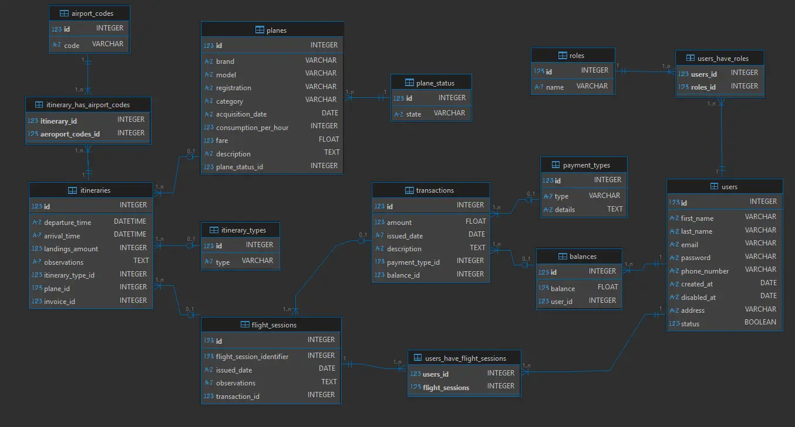

# Versión Español
Esta API REST en **_Flask_** fue originalmente un proyecto universitario que ha sido actualizado con las mejores prácticas y nuevas librerías para sumar seguridad, mantenibilidad y funcionalidad. El código se estructuró siguiendo el patrón **Controlador-Servicio-Repositorio** y convenciones de nomenclatura estándar.

## Ejecución y configuración

La aplicación puede ser ejecutada desde el archivo `app.py`, donde es posible modificar el puerto y el host. Necesitarás instalar las dependencias usando `pip install -r requirements.txt`. Asegúrate de usar Python <= 3.13 y de configurar las variables en el archivo `.env` (configurar una _secret key_ será suficiente para ejecutar el sistema).

El proyecto cuenta con el archivo  `database_filler.py` ubicado en el directorio raíz para generar datos de relleno y necesarios para que la aplicación corra correctamente. Se recomienda ejecutar este archivo ya que cierta información (como Roles y Tipos de Pago) es obligatoria para muchas peticiones.

Se adjunta una colección de Postman con instrucciones para probar la API.

## Descripción general del sistema

El sistema modela un **entorno de entrenamiento de Aeroclub** donde los usuarios gestionan sus finanzas y sesiones de vuelo a través de entidades estructuradas como _saldos_, _transacciones_, _sesiones de vuelo_ e _itinerarios_.

### Roles y Permisos

Existen **tres roles de usuario**, cada uno define qué datos y acciones están permitidas:

|**Rol**|**Descripción**|**Permisos**|
|---|---|---|
|**Usuario**|Rol base para todos los miembros registrados.|Puede ver sus propios datos (saldo, transacciones, sesiones de vuelo) y la información general del club (tarifas, aviones, tipos de itinerario, códigos de aeropuerto).|
|**Instructor**|Usuarios que dirigen los vuelos de instrucción.|Puede ver todos los datos de `Usuario` más información limitada de otros usuarios (alumnos, otros instructores, administradores). Siempre posee tanto el rol de `Usuario` como de `Instructor`.|
|**Admin**|Gestor del sistema con acceso total.|Puede realizar todas las operaciones CRUD, incluyendo la gestión de usuarios, aviones, tarifas y roles. Siempre posee tanto el rol de `Usuario` como de `Admin`.|

Reglas adicionales:

- Toda cuenta incluye siempre, como mínimo, el rol de `Usuario`.
    
- Los **usuarios deshabilitados** (`status=False`) no pueden realizar ninguna petición.
    
- La desactivación de una cuenta puede tardar en surtir efecto hasta que expire el JWT actual (24 horas después de su emisión).
    

### Sistema financiero

Cada usuario recibe un **saldo monetario** al registrarse que puede aumentar o disminuir según su actividad en el aeroclub:

- Los usuarios pueden **agregar fondos**: transacciones positivas vía Efectivo, Transferencia o Cheque.
    
- Los usuarios pueden **pagar sesiones de vuelo**: transacciones negativas que un administrador registra como "Sesión de Vuelo".
    
    No existen **límites superiores o inferiores** en el saldo de un usuario — las políticas administrativas manejan los sobregiros o el crédito excesivo de forma manual.
    

### Sesiones de vuelo

Una **sesión de vuelo** es la unidad central de entrenamiento del sistema — representa uno o más itinerarios de vuelo realizados entre un **alumno (usuario)** y un **instructor** (opcional).

Cada sesión de vuelo:

- Pertenece a un **Usuario**, es registrada por un Administrador y puede incluir un Instructor.
    
- Contiene uno o más **itinerarios**, cada uno describiendo un segmento distinto, el avión utilizado, el tipo de vuelo, el código del aeropuerto de salida y el de aterrizaje para el vuelo de entrenamiento general.
    
- Tiene una **fecha de emisión**, **observaciones** y un **costo total de la sesión**.
    
- Está vinculada a una **transacción** que refleja el costo de la sesión y actualiza el saldo del usuario.
    

Los tiempos de vuelo se registran en incrementos de 0.1h (6 minutos).

El costo de la sesión se calcula sumando la: `tarifa del avión * duración del itinerario` de cada itinerario registrado en la sesión.

### Diagrama de la base de datos

# English Version
This ***Flask*** REST API was originally a college project that was brought up to date with current best practices and new
libraries to add security + maintainability + functionality. The code was structured to follow a **Controller-Service-Repository**
pattern and naming conventions.

## Run and configure

You can run the app from the ``app.py`` file, where you can change the port and host. You'll need to install the libraries
using `pip install -r requirements.txt`. Make sure to use Python <= 3.13 and to configure the variables in the `.env` file (
setting up a secret key will be enough to run the system).

You can insert into the database all the necessary payment types, airport codes, roles, users, and more to run the Postman
examples
running the `database_filler.py` file in the root folder. This will populate the database with example data to play around.
Some data, like Roles and PaymentTypes is mandatory for many requests, so running the file is adviced.

There's an attached Postman collection for instructions to test the API.

## System overview

The system models an **Aero Club training environment** where users manage their finances and flight sessions through structured
entities such as _balances_, _transactions_, _flight sessions_, and _itineraries_.

### Roles and Permissions

There are **three user roles**, each defining what data and actions are allowed:

| Role           | Description                           | Permissions                                                                                                                                               |
|----------------|---------------------------------------|-----------------------------------------------------------------------------------------------------------------------------------------------------------|
| **User**       | Base role for all registered members. | Can view their own data (balance, transactions, flight sessions) and general club information (fares, planes, itinerary types, airport codes).            |
| **Instructor** | Users who conduct training flights.   | Can view all `User` data plus limited information about other users (students, other instructors, admins). Always has both `User` and `Instructor` roles. |
| **Admin**      | Full-access system manager.           | Can perform all CRUD operations, including managing users, planes, fares, and roles. Always has both `User` and `Admin` roles.                            |

Additional rules:

- Every account always includes the `User` role at minimum.
- **Disabled users** (`status=False`) cannot perform any requests.
- Account deactivation might take effect only after the current JWT expires (24 hours after issued).

### Financial system

Each user receives a **monetary balance** upon registration that can increase or decrease based on their activity in the Aero
club:

- Users can **add funds**: positive transactions via Cash, Transfer or Check.
- Users can **pay for flight sessions**: negative transactions that are registered by an admin as "Flight Session".
  There are **no upper or lower limits** on a user’s balance — administrative policies handle overdrafts or excessive credit
  manually.

### Flight Sessions

A **flight session** is the core training unit of the system — it represents one or more flight itineraries conducted between a *
*student (user)** and an **instructor** (optional).
Each flight session:

- Belongs to one **User**, it's registered by an Admin and can include an Instructor.
- Contains one or more **itineraries**, each describing a distinct segment, used plane, flight type, departing airport code and
  landing airport code of the overall training flight.
- Has an **issued date**, **observations**, and a **total session cost**.
- Is linked to a **transaction** that reflects the session’s cost and updates the user’s balance.

Flight times are recorded in 0.1h increments (6 minutes).
The cost of the session is calculated by adding together the: `plane fare * itinerary lenght` of each itinerary registered in the
session.

### Database diagram

